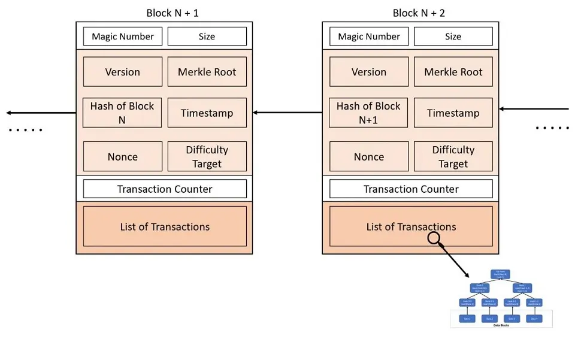
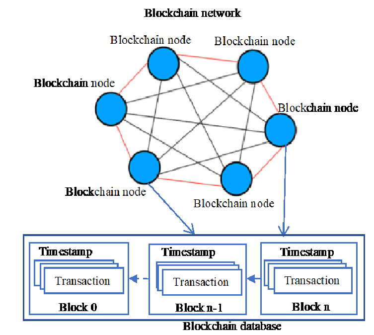
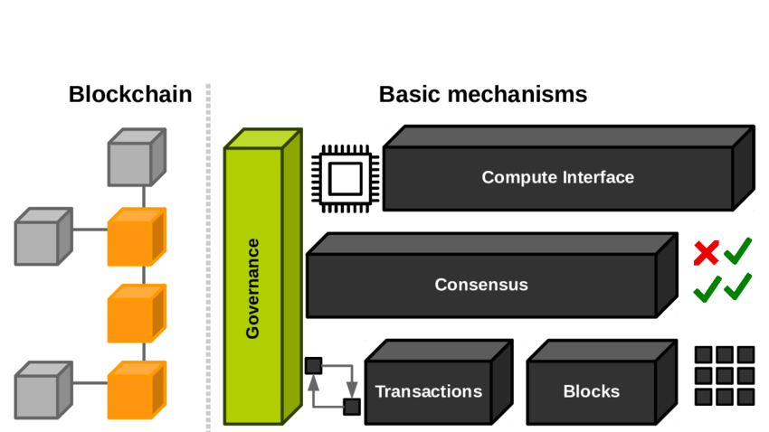

### **Blockchain Architecture and Main Components**

Blockchain architecture is the foundational design that ==enables the functioning of a decentralized and secure system for data storage and transactions==. It is a ==combination of multiple layers and components that work together to achieve transparency, security, and immutability.==

---

### **1. Core Architecture Layers**

Blockchain architecture typically consists of these layers:

1. **Application Layer**:
    - The interface for users and developers.
    - Hosts ==decentralized applications (dApps) and smart contracts.==
    - Example: Wallets, payment systems, DeFi platforms, or supply chain solutions.
2. **Consensus Layer**:
    - ==Ensures all nodes in the network agree on the state of the blockchain==.
    - Uses ==consensus mechanisms like Proof of Work (PoW), Proof of Stake (PoS), or Delegated Proof of Stake (DPoS).==
    - ==Prevents double-spending and maintains the integrity of the chain==.
3. **Network Layer (P2P Layer)**:
    - Handles communication between nodes.
    - Nodes share, propagate, and validate transactions and blocks across the decentralized network.
    - Implements protocols for networking (e.g., TCP/IP, Gossip protocol).
4. **Data Layer**:
    - The foundation where data is stored as a chain of blocks.
    - Each block contains a cryptographic hash, timestamp, and list of transactions.
    - Ensures immutability through cryptographic linking.
5. **Infrastructure Layer**:
    - Includes hardware, physical nodes, and cloud systems where the blockchain is hosted.

---

### **2. Main Components of Blockchain**

The blockchain system has several key components that ensure its functionality:

---

#### **a. Blocks**

- **Structure**:
    - **Header**:
        - **Hash**: ==A cryptographic hash of the previous block's header, linking blocks together.==
        - **Nonce**: ==A random number used in Proof of Work to solve the cryptographic puzzle.==
        - **Timestamp**: The exact time the block was created.
        - **Merkle Root**: A hash that represents the combined data of all transactions in the block.
    - **Body**:
        - A list of validated transactions.

---

#### **b. Transactions**

- Represents data (e.g., payments, smart contract execution).
- Includes:
    - ==Sender and recipient addresses.==
    - Digital signatures for authenticity.
    - Transaction fees.

---

#### **c. Nodes**

- **Full Nodes**:
    - Store the complete blockchain and validate new blocks.
- **Light Nodes**:
    - Only store block headers, not the entire chain.
- **Miner Nodes**:
    - Validate transactions and propose new blocks through mining (PoW) or staking (PoS).
- **Validator Nodes**:
    - Responsible for validating and reaching consensus in PoS or DPoS systems.

---

#### **d. Cryptography**

- **Hashing**:
    - ==Converts input data into fixed-length strings==.
    - ==Example: SHA-256 in Bitcoin.==
- **Digital Signatures**:
    - ==Ensures authenticity and integrity of transactions.==
    - ==Uses public-private key cryptography.==

---

#### **e. Consensus Mechanisms**

- ==Rules for validating transactions and adding blocks==.
- Popular types:
    - **Proof of Work (PoW)**: Solving computational puzzles (e.g., Bitcoin).
    - **Proof of Stake (PoS)**: Validators are chosen based on staked tokens (e.g., Ethereum 2.0).

---

#### **f. Smart Contracts**

- Self-executing contracts with predefined rules encoded in code.
- Automatically enforce agreements when conditions are met.
- Example: Ethereum smart contracts for DeFi or NFTs.

---

#### **g. Ledger**

- ==A tamper-proof, decentralized database where all transaction data is recorded.==
- Distributed across all nodes.

---

#### **h. Blockchain Protocol**

- Defines how the blockchain operates, including transaction validation, block creation, and communication rules.
- Example: Bitcoin Protocol, Ethereum Protocol.

---

### **3. Key Processes in Blockchain**

- **Block Creation**: Transactions are grouped into a block by miners or validators.
- **Validation**: Blocks are validated through consensus mechanisms.
- **Propagation**: Valid blocks are shared across the network.
- **Immutability**: Once a block is added, altering it would break the chain.

---

### **Summary**

The **architecture** of blockchain ensures decentralization, transparency, and security. It relies on components like blocks, transactions, nodes, cryptography, and smart contracts, all integrated through a layered structure. This design underpins its versatility across industries like finance, healthcare, and supply chains.

---

---

