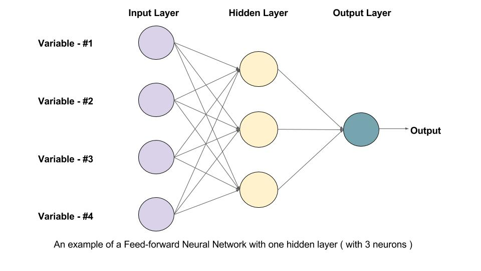

- In a **feedforward neural network**, data moves forward from the input layer through hidden layers to the output layer.
- Each layer transforms the input data using weights, biases, and activation functions.

A Feedforward Neural Network (FNN) is a type of artificial neural network where connections between the nodes do not form cycles. This characteristic differentiates it from recurrent neural networks (RNNs). The network consists of an input layer, one or more hidden layers, and an output layer. Information flows in one direction—from input to output—hence the name "feedforward."

### Structure of a Feedforward Neural Network

1. ****Input Layer****: The [input layer](https://www.geeksforgeeks.org/keras-input-layer/) consists of neurons that receive the input data. Each neuron in the input layer represents a feature of the input data.
2. ****Hidden Layers****: One or more hidden layers are placed between the input and output layers. These layers are responsible for learning the complex patterns in the data. Each neuron in a hidden layer applies a weighted sum of inputs followed by a non-linear activation function.
3. ****Output Layer****: The output layer provides the final output of the network. The number of neurons in this layer corresponds to the number of classes in a classification problem or the number of outputs in a regression problem.